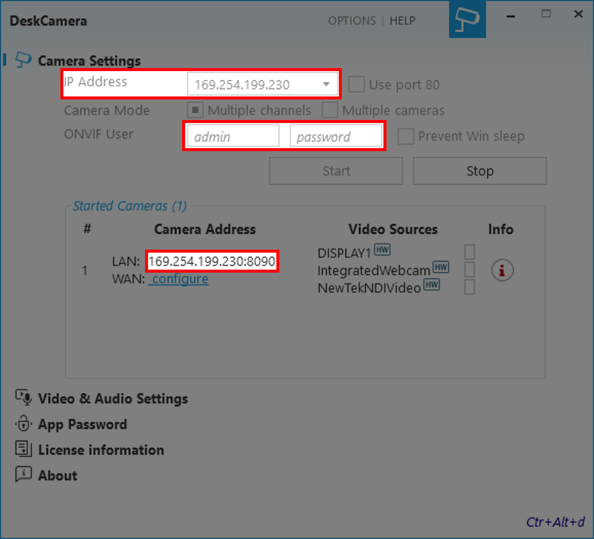

# TouchDesigner ONVIF Connectivity
A small project (documentation of sorts) to demonstrate the usage of ONVIF protocol with TouchDesigner on Windows10.<br>
The document assumes that you are smarter than I am; some basic knowledge on TouchDesigner is needed.<br>

# Index
* [Requirements](#requirements)
* [Initial Steps](#initial-steps)
	* [Find TouchDesigner's python version](#find-touchdesigners-python-version)
	* [Create a python environment using Conda](#create-a-python-environment-using-conda)
	* [TouchDesigner Setup](#touchdesigner-setup)
	* [DeskCamera Setup](#deskcamera-setup)

# Requirements
* [TouchDesigner](https://derivative.ca/download) `v2022.28040` or newer
* [Anaconda3](https://www.anaconda.com/products/distribution) `conda 4.12.0` or newer
* Camera with ONVIF protocol support<br>
	or<br>
	[DeskCamera](https://www.deskcamera.com/download/#:~:text=Download%20DeskCamera%205.2.6%20%E2%80%93%20(June%2026%2C%202022)%20Windows%C2%A0x64%C2%A0installer) `v5.2.6` or newer ( *for testing purposes* )

# Initial Steps
## Dealing with python stuff
### Find TouchDesigner's python version
There are two ways to find python version installed in TouchDesinger.
1. Open TextPort as shown in the gif below.<br>
The version is usually displayed at the beginning.
2. If the screen is cleared, type:<br>
```python
print(sys.version)
```
<p align="center">
	
</p>

### Anaconda Setup
1. Open `Anaconda Prompt (Anaconda3)` from Windows search bar.
2. List all the python environments:
```python
conda env list
```
3. Create new anaconda environment (python version is found in TD):
```python
conda create -n TD_Onvif_LC python=3.9.5
```
4. Activate the environment
```python
conda activate TD_Onvif_LC
```
5. See list of installed packages
```python
conda list
```
6. Install `onvif_zeep`
```python
pip install onvif_zeep
```
7. Check whether onvif_zeep is installed using `conda list`.
Installing onvif_zeep will install following additional packages:
```
# Name               Version    Build       Channel
attrs                22.1.0     pypi_0      pypi
cached-property      1.5.2      pypi_0      pypi
charset-normalizer   2.1.1      pypi_0      pypi
idna                 3.3        pypi_0      pypi
isodate              0.6.1      pypi_0      pypi
lxml                 4.9.1      pypi_0      pypi
onvif-zeep           0.2.12     pypi_0      pypi
platformdirs         2.5.2      pypi_0      pypi
pytz                 2022.2.1   pypi_0      pypi
requests             2.28.1     pypi_0      pypi
requests-file        1.5.1      pypi_0      pypi
requests-toolbelt    0.9.1      pypi_0      pypi
six                  1.16.0     pypi_0      pypi
urllib3              1.26.12    pypi_0      pypi
zeep                 4.1.0      pypi_0      pypi
```

## DeskCamera Setup
Skip to [PTZ Camera Setup](#ptz-camera-setup), if you have an ONVIF PTZ camera.<br>
If you want to test whether TouchDesigner works with ONVIF in the first place, you could use these steps.

Once the DeskCamera application is installed and the not-so-friendly process of licensing is complete, the application should look something like this:<br>
<p align="center">
	
</p>

The key elements here are:<br>
```
IP Address
Port
Username
Password
```
<p align="center">
	
</p>

You could choose to run it on a preferred network interface by changing the IP Address option.<br>
In the setup for this documentation, the values are as below:
```
IP Address : 169.254.199.230
Port       : 8090
Username   : admin
Password   : password
```

## TouchDesigner Setup
1. Add `Execute DAT` and add the script from [`1_setup_python_variables.py`](/rsc/1_setup_python_variables.py).
2. Change `username`'s value in line-12 to the username on your PC.
3. Change `envrname`'s value in line-13 to the name you assigned when creating your python environment.
4. In the `Parameter` window of this `Execute DAT`, ensure that `Start` is toggled `On`.<br>
This helps to run this script once as soon as the project is launched from the next instance.<br>
However, we need to use it also in the current instance.<br>
To do this, click on `Pulse`, next to `Start`.
5. Create a `Text DAT` and add the script from [`2_python_onvif.py`](/rsc/2_python_onvif.py)
6. Right-click on `Text DAT` and select `Run`.

This should then show the name of the PC on the output.

## PTZ Camera Setup